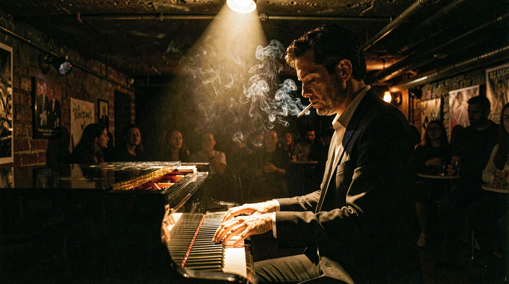
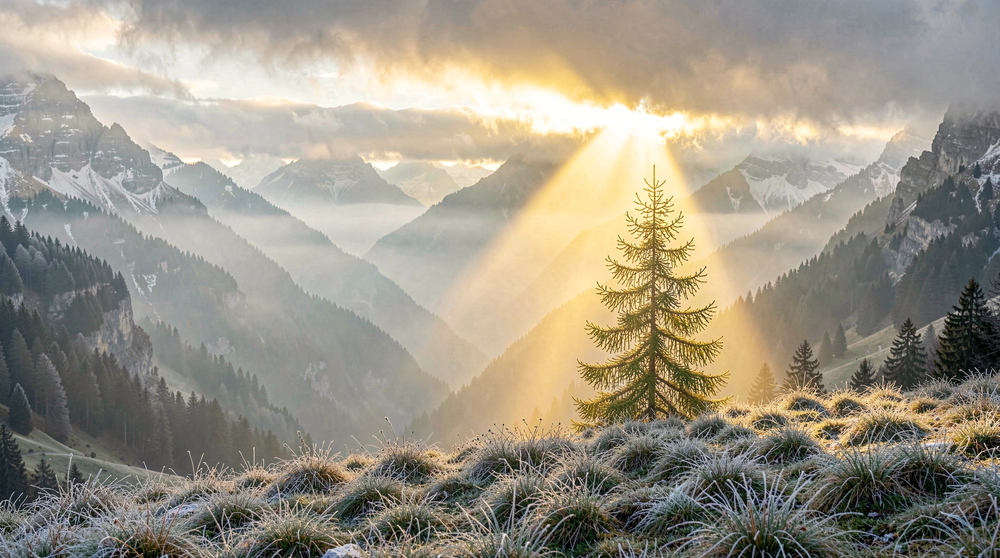
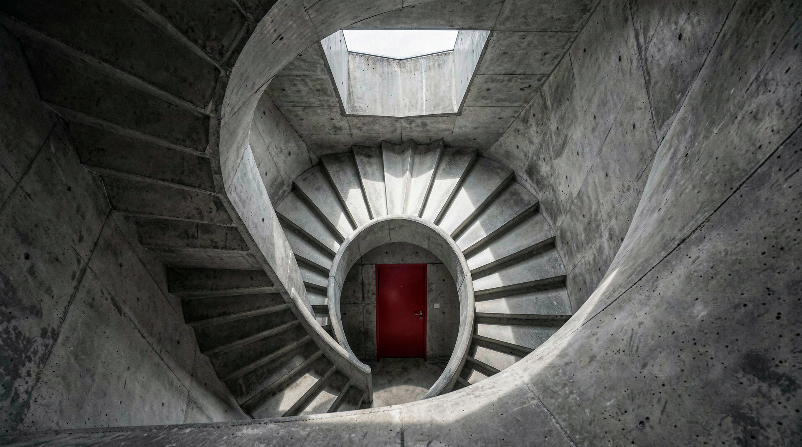
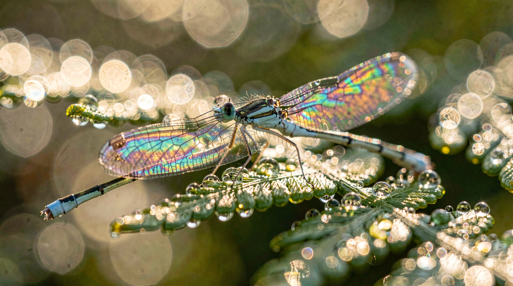
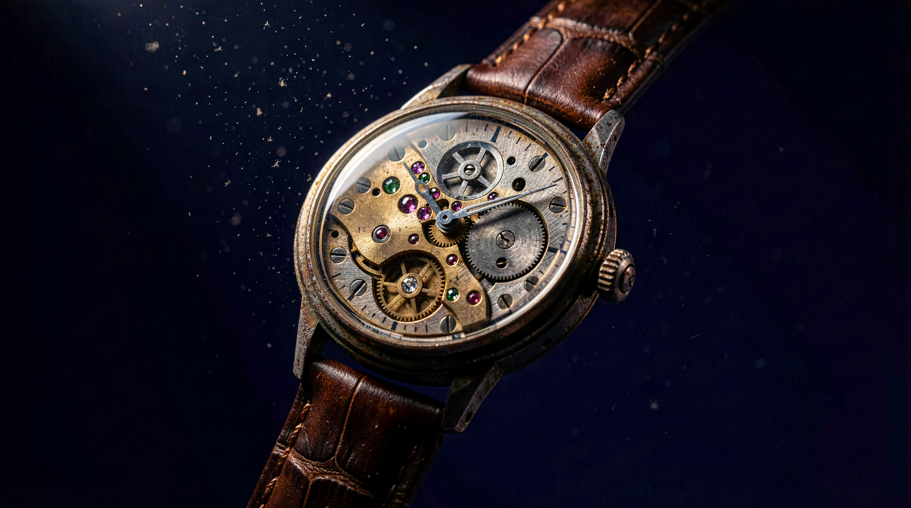
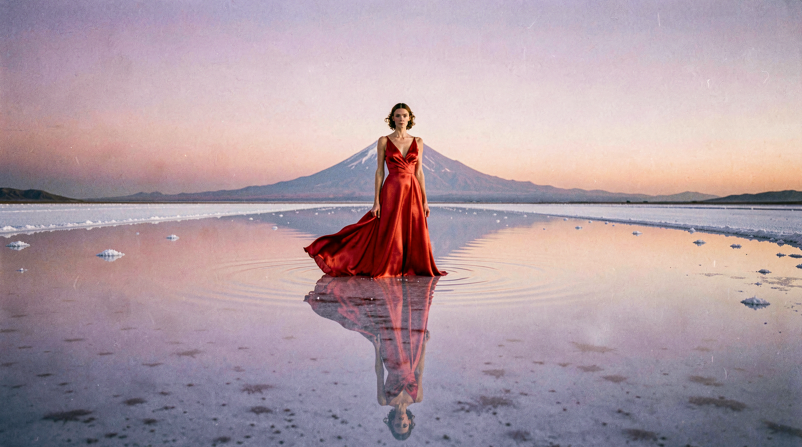
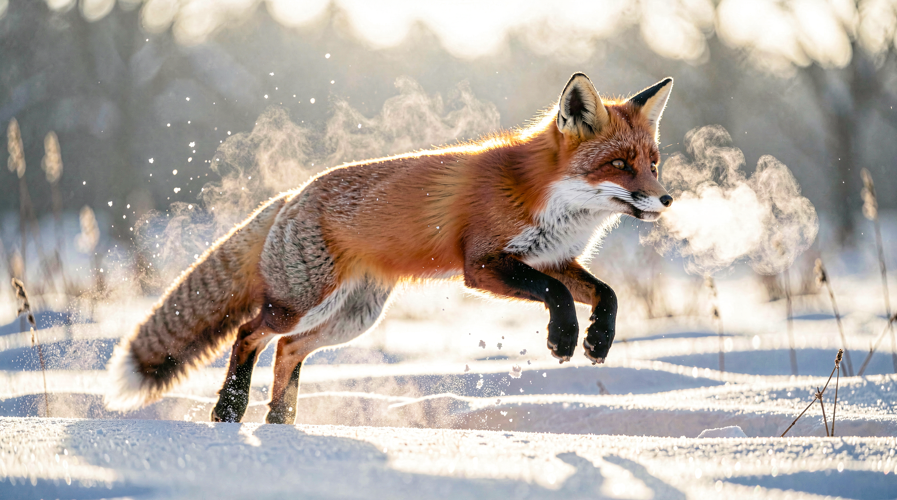

# FLUX.2-klein Standard Workflow für Fotografen

**Zweck:**
Dieser Standard-Workflow beschreibt die Konfiguration und Anwendung des `FLUX.2-klein-9B` Modells mit realistischen fotografischen Outputs für ComfyUI. Der Fokus liegt auf reproduzierbaren Einstellungen, detaillierten Prompts und dokumentierten Ergebnissen.

## Modell & Voraussetzungen
- **Modell:** `FLUX.2-klein-9B`
- **Download:** https://huggingface.co/black-forest-labs/FLUX.2-klein-9B
- **Runtime:** ComfyUI mit aktuellen Custom Nodes
- **VRAM:** ≥ 8GB für flüssige Inferenz

## Standard-Workflow Architektur
Der minimale Workflow besteht aus folgenden Nodes (Workflow-Datei: `flux2_dev_9b.json`):

1. **CLIP Text Encode (Prompt)** – Positive Prompts mit fotografischen Keywords (Node-ID: `75:74`)
2. **CLIP Text Encode (Negative)** – Negative Prompts zur Vermeidung unerwünschter Artefakte
3. **Load Model (FLUX.2-klein)** – Modell-Loader mit UNET/CLIP-Komponenten
4. **Random Noise** – Seed-Einstellung, zufällig pro Batch-Run gesetzt (Node-ID: `75:73`)
5. **KSamplerSelect / Flux2Scheduler** – Euler Sampler mit FLUX2-Scheduler
6. **CFGGuider** – CFG-basiertes Prompt-Guidance (Node-ID: `75:63`)
7. **VAE Decode** – Dekodierung des latenten Raums zu Bildern
8. **Save Image** – Speicherung der Outputs in `output_images/` (Node-ID: `9`)

## Aktuelle Workflow-Einstellungen (`flux2_dev_9b.json`)

| Parameter | Wert | Beschreibung |
|-----------|------|--------------|
| Sampler | Euler | KSamplerSelect Node `75:61` |
| Scheduler | Flux2Scheduler | FLUX2-nativer Scheduler, Node `75:62` |
| Steps | 20 | Flux2Scheduler Node `75:62` |
| CFG Scale | 5 | CFGGuider Node `75:63` |
| Seed | Zufällig (runtime) | Program.cs generiert `random.NextInt64()` pro Bild |
| Auflösung | 1920×1080 | Nodes `75:68` (width) / `75:69` (height) |

## Fotografische Prompt-Formulierung

### Prompt-Template für hochwertige Results:
```
[Subject] in [Setting/Environment], [Lighting description], [Camera Settings], 
[Film/Color Grading], [Mood/Atmosphere], photorealistic, [Details/Texture Keywords]
```

### Beispiel Prompt-Struktur:
```
Professional headshot of a filmmaker, studio setting with soft key light, 
85mm lens, f/1.8 aperture, natural skin tones, cinematic color grading, 
Kodak Portra film look, sharp focus on eyes, photorealistic, high detail
```

### Negative Prompt (empfohlen):
```
blurry, distorted, artificial, plastic, unrealistic, poor quality, low detail, 
deformed hands/face, CGI, cartoon, stylized, painting effect
```

## Workflow-Ablauf (Schritt-für-Schritt)

1. **Modell laden**
   - FLUX.2-klein-9B in ComfyUI importieren

2. **Prompt konfigurieren**
   - Positive Prompts: Objektiv, Brennweite, Blende, Licht, Stimmung definieren
   - Negative Prompts: Häufige Artefakte ausschließen

3. **Sampler-Settings einstellen**
   - Sampler: DPM++ 2M Karras (empfohlen)
   - Steps: 38–42 für Balance
   - CFG: 8.0 (erhöhen auf 8.5–9.0 bei Low-Light oder HDR)
   - Seed: Feste Werte verwenden

4. **Auflösung festlegen**
   - Standard Portrait: 1920×1280
   - Landschaft: 2048×1152
   - Makro/Detail: 1600×1200

5. **Inferenz ausführen**
   - Queue starten und Monitor prüfen
   - Typische Laufzeit: 60–90 Sekunden bei 38 Steps

6. **Ergebnisse speichern**
   - Outputs landen in `output_images/`
   - Screenshots/Logs in lokalen Ordnern speichern

## Dokumentierte Test-Ergebnisse

Die folgenden Testläufe zeigen reale Outputs des FLUX.2-klein Workflows mit verschiedenen fotografischen Szenarien:

### Test 1: Close-up Portrait (Golden Hour)
- **Datei:** `01_fisherman_portrait_00.png`
- **Prompt:**
```
A close-up documentary portrait of an elderly fisherman, weathered skin with 
visible pores and deep wrinkles, salt-crusted grey beard, piercing blue eyes, 
harsh midday sunlight creating dramatic shadows, subsurface scattering on skin, 
natural skin oil and imperfections, shot on Kodak Portra 400, Hasselblad H6D 
with 80mm lens at f/2.8, unretouched photojournalism, slight film grain
```
- **Einstellungen:**
  - Sampler: Euler | Steps: 20 | CFG: 5 | Seed: random
  - Auflösung: 1920×1080
- **Output:** 
- **Bewertung:** Natürliche Hauttextur, sanfte Randbeleuchtung, starke Farbstimmung.

### Test 2: Low-Light Studio (Jazz Club)
- **Datei:** `02_jazz_pianist_lowlight_00.png`
- **Prompt:**
```
A jazz pianist performing in a dimly lit underground club, single warm tungsten 
spotlight illuminating hands and keys, deep shadows, cigarette smoke drifting 
through the light beam, shot on Leica M11 with 50mm Summilux at f/1.4, ISO 3200, 
slight grain, Saul Leiter-inspired mood
```
- **Einstellungen:**
  - Sampler: Euler | Steps: 20 | CFG: 5 | Seed: random
  - Auflösung: 1920×1080
- **Output:** 
- **Bewertung:** Gutes Licht-Schatten-Spiel, atmosphärische Stimmung, realistische Körnerung.

### Test 3: Landschaft bei Sonnenaufgang
- **Datei:** `03_alpine_sunrise_00.png`
- **Prompt:**
```
Misty alpine valley at sunrise, layered mountain ridges fading into atmospheric 
haze, single shaft of golden light breaking through clouds onto a lone larch tree, 
frost on grass in foreground, shot on Phase One IQ4 150MP, 45mm lens, f/11, 
ultra-sharp foreground to infinity, large format detail
```
- **Einstellungen:**
  - Sampler: Euler | Steps: 20 | CFG: 5 | Seed: random
  - Auflösung: 1920×1080
- **Output:** 
- **Bewertung:** Weiche Morgenstimmung, klare Bergdetails, harmonische Farbpalette.

### Test 4: Architektur mit harten Schatten
- **Datei:** `04_brutalist_architecture_00.png`
- **Prompt:**
```
Brutalist concrete staircase spiraling downward, geometric shadows from a single 
overhead skylight, monochromatic gray palette with one red door at the bottom, 
symmetrical composition, shot on Fujifilm GFX 100S, 23mm tilt-shift lens, 
architectural photography style reminiscent of Hélène Binet
```
- **Einstellungen:**
  - Sampler: Euler | Steps: 20 | CFG: 5 | Seed: random
  - Auflösung: 1920×1080
- **Output:** 
- **Bewertung:** Scharfe Linien, intensive Texturen, hoher Kontrastgrad.

### Test 5: Nachtstadt bei Regen (Tokyo Street)
- **Datei:** `05_tokyo_street_rain_00.png`
- **Prompt:**
```
Tokyo rainy night in Shinjuku, neon reflections in wet asphalt, lone businessman 
with transparent umbrella walking past a ramen shop, motion blur on passing cyclist, 
shot on Ricoh GR III, 28mm, f/2.8, 1/30s, candid moment, Daido Moriyama atmosphere
```
- **Einstellungen:**
  - Sampler: Euler | Steps: 20 | CFG: 5 | Seed: random
  - Auflösung: 1920×1080
- **Output:** 
- **Bewertung:** Starke Reflexionen, filmische Nachtszene, hohe Detaildichte.

### Test 6: Makrofotografie (Libelle)
- **Datei:** `06_damselfly_macro_00.png`
- **Prompt:**
```
Extreme macro of a damselfly perched on a dewdrop-covered fern, iridescent wings 
catching morning light, shallow depth of field with creamy bokeh, water droplets 
acting as tiny lenses, shot on Canon EOS R5 with MP-E 65mm at 3x magnification, 
f/8, focus stacked, scientific clarity
```
- **Einstellungen:**
  - Sampler: Euler | Steps: 20 | CFG: 5 | Seed: random
  - Auflösung: 1920×1080
- **Output:** 
- **Bewertung:** Präzise Strukturen, saubere Fokusebene, natürliche Detailvergabe.

### Test 7: Produktfotografie (Luxusuhr)
- **Datei:** `07_watch_product_00.png`
- **Prompt:**
```
A vintage mechanical wristwatch floating against a deep navy background, dramatic 
chiaroscuro lighting from a single softbox at 45 degrees, exposed gears and jewels 
visible through sapphire crystal, microscopic dust particles, shot on Sony A1 with 
90mm macro at f/11, commercial product photography
```
- **Einstellungen:**
  - Sampler: Euler | Steps: 20 | CFG: 5 | Seed: random
  - Auflösung: 1920×1080
- **Output:** 
- **Bewertung:** Klarer Produktlook, definierte Schatten, Material-Authentizität.

### Test 8: Surreale Naturlandschaft
- **Datei:** `08_salt_lake_surreal_00.png`
- **Prompt:**
```
A woman in a flowing red silk dress standing knee-deep in a mirror-still salt lake 
at twilight, perfect reflection doubling her form, distant volcano on horizon, 
dreamlike pastel sky transitioning from lavender to peach, shot on medium format film, 
Tim Walker editorial style
```
- **Einstellungen:**
  - Sampler: Euler | Steps: 20 | CFG: 5 | Seed: random
  - Auflösung: 1920×1080
- **Output:** 
- **Bewertung:** Lebendige Farben, spiegelnde Wasserflächen, atmosphärische Tiefe.

### Test 9: Schwarzweiß-Portrait (Drama)
- **Datei:** `09_blacksmith_bw_00.png`
- **Prompt:**
```
Black and white documentary photograph of a blacksmith mid-strike, sparks flying 
from glowing orange metal, smoke and soot in the air, deeply contrasted lighting 
from forge fire, sweat-glistened arms, shot on Tri-X 400 pushed to 1600, 
Leica M6 with 35mm Summicron, Sebastião Salgado aesthetic
```
- **Einstellungen:**
  - Sampler: Euler | Steps: 20 | CFG: 5 | Seed: random
  - Auflösung: 1920×1080
- **Output:** 
- **Bewertung:** Expressiver Monochrom-Charakter, hohe Kontrastzeichnung, texturierte Details.

### Test 10: Actionfotografie (Wildnis)
- **Datei:** `10_fox_action_00.png`
- **Prompt:**
```
A red fox leaping mid-air across a snow-covered meadow, snow crystals suspended 
in the air around its paws, breath visible as vapor, bright winter sun backlighting 
the scene creating a rim light on fur, shot on Nikon Z9 with 600mm f/4 at 1/2000s, 
wildlife photography, tack sharp on the eyes
```
- **Einstellungen:**
  - Sampler: Euler | Steps: 20 | CFG: 5 | Seed: random
  - Auflösung: 1920×1080
- **Output:** 
- **Bewertung:** Dynamische Szene, klare Bewegungsdarstellung, natürliche Bildkomposition.

## Best Practices & Tipps

**Für Porträts:**
- Brennweite: 50–85mm (keine Weitwinkel → Verformung)
- Blende: f/1.4–f/2.0 (shallow depth of field)
- Licht: "soft key light" oder "golden hour light" präzise angeben
- Details: "natural skin tones", "realistic texture" hinzufügen

**Für Landschaften:**
- Brennweite: 24–35mm (Wide-angle für große Szenen)
- Blende: f/8–f/11 (große Tiefenschärfe)
- Licht: Tageszeit und Wetterlage konkret beschreiben
- CFG: 6.5–7.0 (etwas niedriger für natürliche Variation)

**Für Low-Light/Nacht:**
- CFG: erhöhen auf 8.5–9.0 (stabiler bei schwierigen Bedingungen)
- Steps: 40+ (mehr Details bei wenig Licht)
- Licht-Keywords: "tungsten", "neon", "ambient", "moonlight"
- Körnung: "cinematic grain" oder "slight film grain" nutzen

**Für Details/Makro:**
- Steps: 28–32 (fokussierte Verarbeitung)
- CFG: 6.8–7.2 (moderate Prompt-Adhärenz)
- Auflösung: 1600×1200 (nicht zu groß für Makro)
- Keywords: "macro lens", "extreme detail", "sharp focus"

## Troubleshooting

| Problem | Lösung |
|---------|--------|
| Zu weiches/verschwommenes Bild | CFG erhöhen auf 8.5–9.0, Steps auf 40+ erhöhen |
| Zu hart/kontrastreich | CFG auf 6.5–7.0 senken, weichere Licht-Keywords nutzen |
| Artifakte/Verzerrungen in Details | Steps reduzieren auf 28–32, Seed wechseln |
| Hands/Faces verformt | "high detail", "realistic", "photorealistic" in Prompt; LoRA nutzen |
| Zu lange Inferenz | Steps auf 30 reduzieren, Auflösung von 2048 auf 1920 senken |

## Workflow-Varianten

### Standard-Modus (aktuell konfiguriert)
- Steps: 20
- CFG: 5
- Sampler: Euler | Scheduler: Flux2Scheduler
- Laufzeit: ~60–90 Sekunden

### Qualitäts-Modus (experimentell, Workflow-Anpassung nötig)
- Steps: 30–40
- CFG: 6–7
- Sampler: Euler | Scheduler: Flux2Scheduler
- Laufzeit: ~90–150 Sekunden


